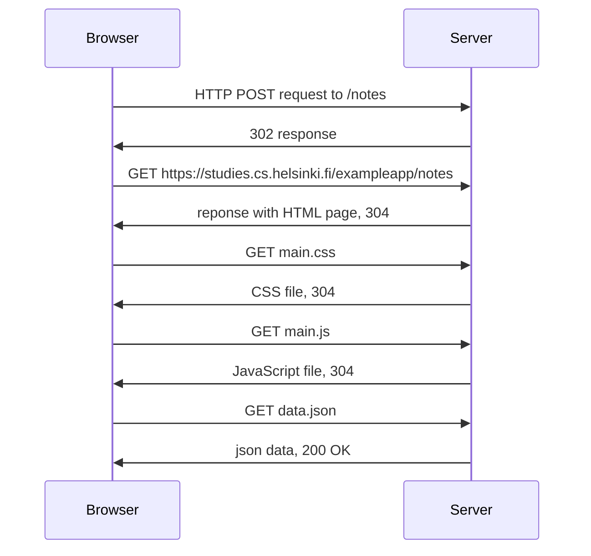

```mermaid
sequenceDiagram
participant Browser
participant Server
      Browser->>Server: HTTP POST request to /notes
      Server->>Browser: 302 response
      Browser->>Server: GET https://studies.cs.helsinki.fi/exampleapp/notes
      Server->>Browser: reponse with HTML page, 304
      Browser->>Server: GET main.css
      Server->>Browser: CSS file, 304
      Browser->>Server: GET main.js
      Server->>Browser: JavaScript file, 304
      Browser->>Server: GET data.json
      Server->>Browser: json data, 200 OK

```
